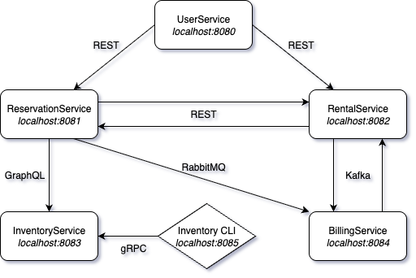

# quarkus-in-action

This project uses Quarkus, the Supersonic Subatomic Java Framework.

If you want to learn more about Quarkus, please visit its website: <https://quarkus.io/>.

## Arch Diagram



### To remember

1. Install Quarkus CLI
    ```
    brew install quarkusio/tap/quarkus
    ``` 
2. Use GraalVM
    ```
    sdk use java 21.0.2-graalce
    ```
3. Package your application into a native executable
    ```
    quarkus build --native
    ```
4. Run the Quarkus application by directly running the generated binary
    ```
   ./target/quarkus-in-action-1.0-SNAPSHOT-runner
    ```
5. List all extensions already installed in the Quarkus application
   ```
   quarkus extension list
   ```
6. List all available installable extensions
   ```
   quarkus extension --installable
   ```
7. List the extension categories
   ```
   quarkus extension categories
   quarkus extension list --installable --category "categoryId"
   quarkus ext list -ic "messaging" --full
   quarkus ext add "quarkus-messaging-kafka"
   quarkus ext remove "quarkus-messaging-kafka"
   ```
8. Override application.properties with the system property definition
   ```
   GREETING="Environment variable value" quarkus dev -Dgreeting="System property value"
   ```
9. Override application.properties without the system property definition 
   ```
   GREETING="Environment variable value" quarkus dev
   ```
10. When you press the 'c' key in the terminal where your Dev mode application is running, it shows information about all running Dev Services containers.
